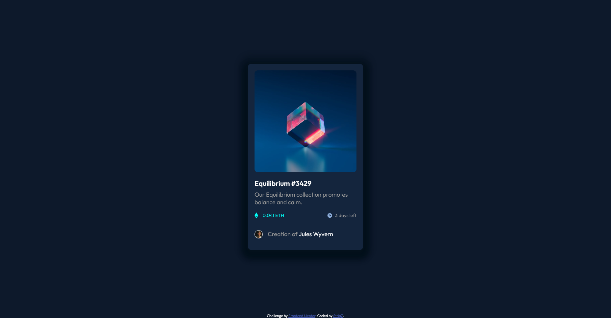

# Frontend Mentor - NFT preview card component solution

This is a solution to the [NFT preview card component challenge on Frontend Mentor](https://www.frontendmentor.io/challenges/nft-preview-card-component-SbdUL_w0U). Frontend Mentor challenges help you improve your coding skills by building realistic projects. 

## Table of contents

- [Overview](#overview)
  - [The challenge](#the-challenge)
  - [Screenshot](#screenshot) 
- [My process](#my-process)
  - [Built with](#built-with)
  - [What I learned](#what-i-learned)
- [Author](#author)


## Overview

### The challenge

Users should be able to:

- View the optimal layout depending on their device's screen size
- See hover states for interactive elements

### Screenshot


 
## My process

### Built with

- Semantic HTML5 markup
- CSS custom properties
- Flexbox

### What I learned

Learned how to alter images on hover.
```html
 <div class="card__img-box">
                
                <div class="card__imgbox-overlay">
                    
                </div>
            </div>
```
```css
.card__img {
    display: block;
    width: 100%;
    height: auto;
    transition: .5s ease;
    backface-visibility: hidden;
    border-radius: 10px;
    position: relative;
}

.card__imgbox-overlay {
    width: 100%;
    height: 100%;
    position: absolute;
    top: 0;
    left: 0;
    opacity: 0;
    display: flex;
    justify-content: center;
    align-items: center;
    transition: opacity .3s;
    background-color: rgba(0, 255, 247, 0.5);
}

.card__imgbox-overlay:hover {
    opacity: 1;
    cursor: pointer;
}
```


## Author

- Github - [StrigZ](https://github.com/StrigZ)
- Frontend Mentor - [@StrigZ](https://www.frontendmentor.io/profile/StrigZ) 